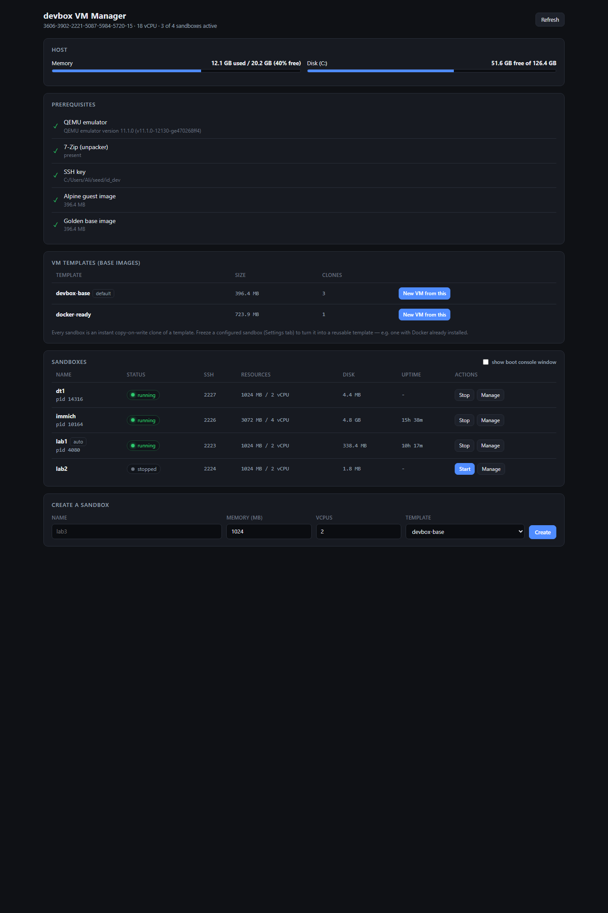
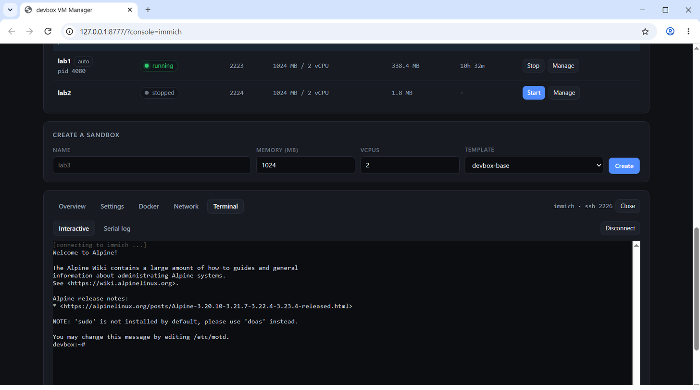
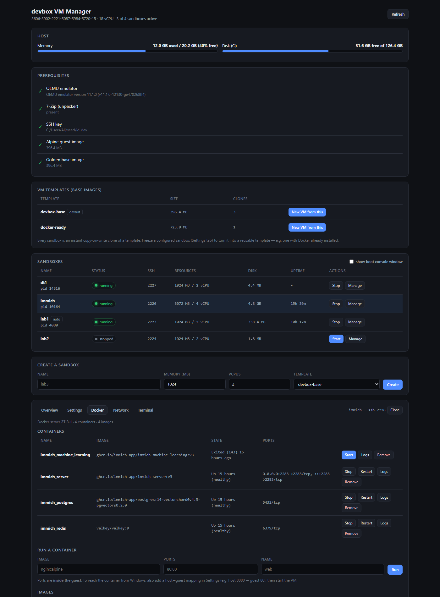
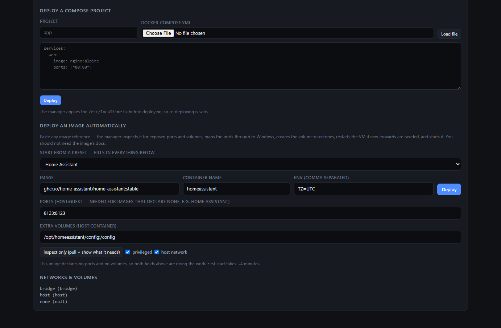
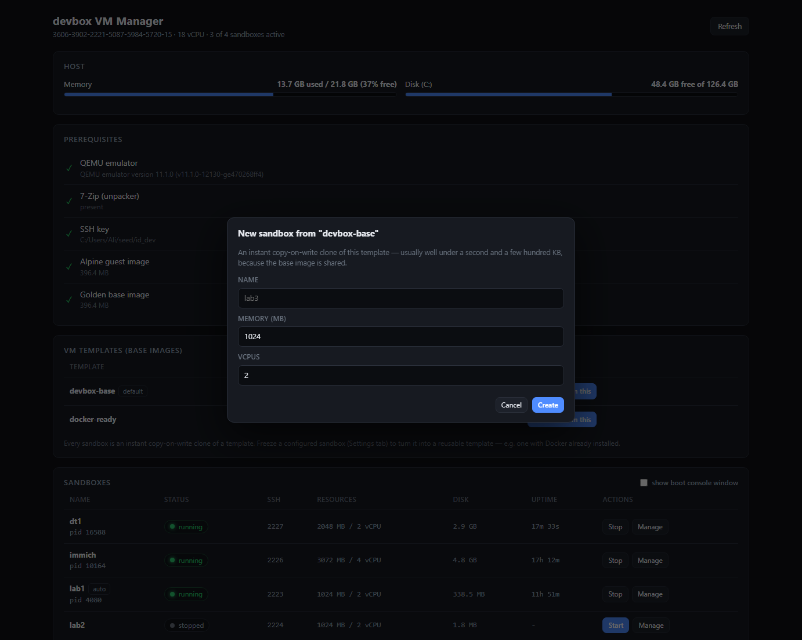
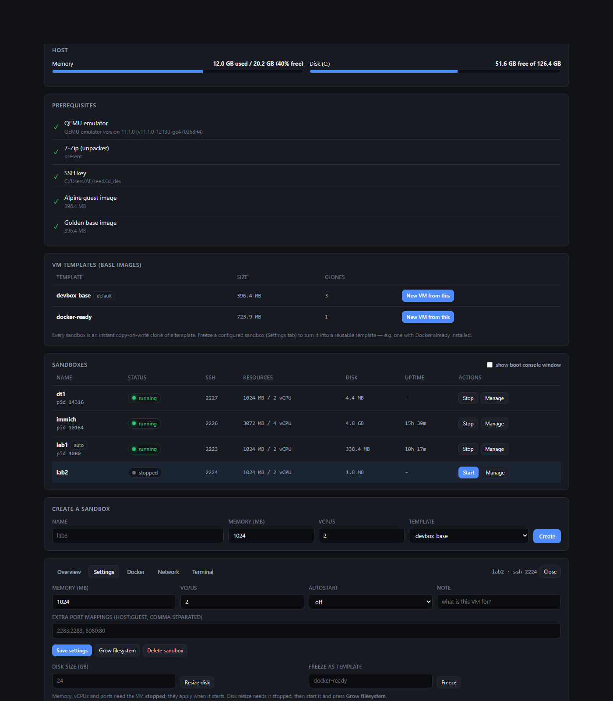
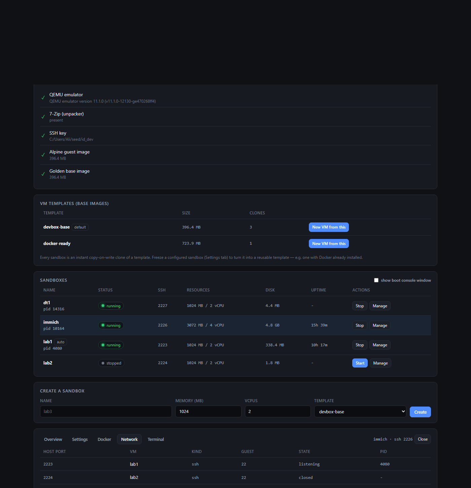
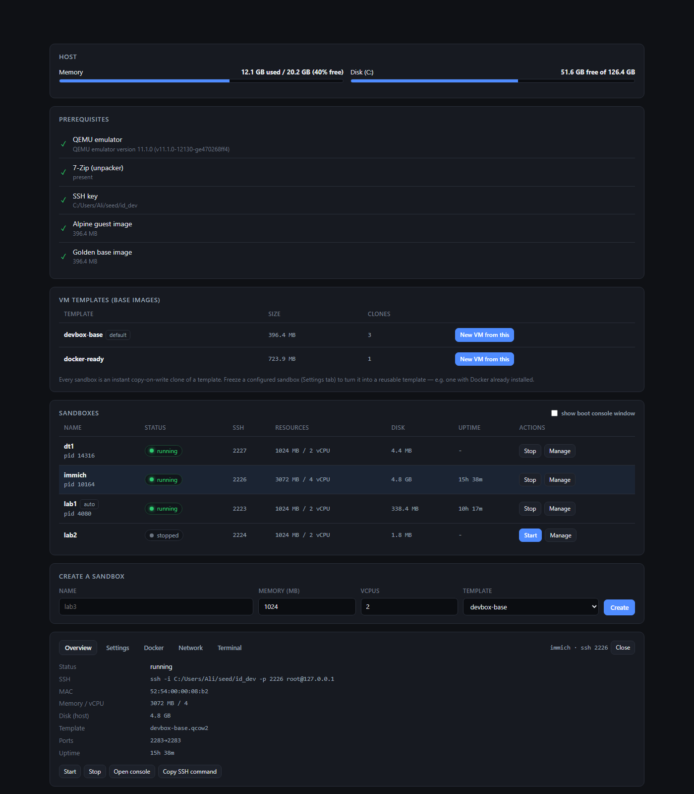

# devbox VM Manager

A local control panel for the QEMU headless Linux VMs on this machine.
No admin rights, no Hyper-V, no WSL, no `npm install` — Node standard library only.

## Run it

Double-click **`vm-manager.cmd`**, or:

```
%USERPROFILE%\vm-manager\vm-manager.cmd
```

It opens a console window (keep it open — that IS the server) and launches the GUI
at <http://127.0.0.1:8777/>.

## Interaction conventions

**No native browser dialogs.** `prompt()`, `confirm()` and `alert()` are not
used anywhere in the GUI:

- they block the whole page and the event loop while open
- they cannot be styled, so they look nothing like the app
- `prompt()` is disabled outright in sandboxed or cross-origin iframes, and
  silently returns `null` there — the action just appears to do nothing
- `confirm()` returns a `boolean` with no way to distinguish "user said no"
  from "browser suppressed it"

Instead there is one `modal()` helper that returns a promise, resolving the
field values on submit or `null` if cancelled. Escape and clicking the backdrop
both cancel. `window.open()` is avoided for the same class of reason — popup
blockers kill it without a visible error — so logs and command output render in
a dialog instead.

## Screenshots

### Dashboard — host, prerequisites, templates, sandboxes

Host memory/disk meters; the prerequisite checklist (QEMU, 7-Zip, SSH key, guest
image, golden base); **VM templates** with how many clones each one has; the
sandbox table with live status, SSH port, resources, disk footprint and uptime;
and the create form with a template picker.



### Interactive terminal, in the browser

A real shell in a tab — not a log pane. The system `ssh.exe` is bridged to
xterm.js over SSE for output and POST for input, so closing the tab ends an SSH
*client* and never touches the VM. The **Serial log** sub-tab shows the raw
console, which still works while a VM is booting.



### Docker management

Install Docker into a guest, then see and drive its containers, images, networks
and volumes. Containers can be started, stopped, restarted, removed, and their
logs opened. Images can be pulled and removed, a container run directly, or a
whole compose project deployed — the manager applies the `/etc/localtime`
normalisation first, so re-deploying is safe.



### Docker deploy box

Pick a preset or paste an image; **Inspect only** shows what it wants before you
commit to anything. Ports and volumes override what the image fails to declare.



### New sandbox dialog

In-app modal, not a native `prompt()` — see *Interaction conventions* above.



### Per-VM settings

Memory, vCPUs, autostart and a note; extra host→guest port mappings; disk resize
and filesystem growth; **freeze as template** turns a configured sandbox into a
reusable base image; and delete.

Memory, vCPUs and ports require the VM stopped — QEMU fixes them at launch.



### Network view

Every host→guest forward across all VMs in one table, with the listening state,
the owning PID, and conflict detection if two VMs claim the same host port.



### VM overview

Per-VM identity and facts: status, the exact SSH command, MAC, resources, disk
usage, which template it came from, its port mappings, and uptime.



## What the GUI does

**Host** — live memory and disk meters.

**Prerequisites** — detects what's missing and installs it on demand:
QEMU (downloaded and unpacked with 7-Zip, no installer), SSH key (generated),
Alpine guest image, and the golden base (built by booting the guest once under
cloud-init, installing a toolchain, then freezing it).

**VM templates (base images)** — every sandbox is an instant copy-on-write clone of
a template, so creating one costs ~200 KB and no boot-time configuration.

| Template | Purpose |
|---|---|
| `devbox-base` | Alpine + toolchain (Python, git, gcc, bash, jq, …) |
| `docker-ready` | the same, **plus Docker installed and running** |

- **New VM from this** — clones a template.
- **Freeze** (Settings tab) — turns a configured sandbox into a new template,
  flattening the backing chain so it is standalone. This is how `docker-ready`
  was made: install Docker once in a sandbox, freeze it, and every later sandbox
  has Docker at boot.

**Sandboxes** — start / stop / manage, with live status (`stopped` → `booting` →
`running`, where `running` means a real **sshd banner** was read, not just that a
process exists).

**VM detail panel** — five tabs per sandbox:

| Tab | Contents |
|---|---|
| **Overview** | status, SSH command, MAC, resources, disk, template, ports, uptime |
| **Settings** | memory, vCPUs, autostart, note, extra port mappings, disk resize, grow filesystem, freeze as template, delete |
| **Docker** | install Docker; containers (start/stop/restart/remove/logs); images (pull, remove); run a container; deploy a compose project; networks and volumes |
| **Network** | every host→guest forward across all VMs, with listening state, owning PID, and conflict detection |
| **Terminal** | interactive browser shell (xterm.js) + the read-only serial log |

### Rules the UI enforces

- Memory, vCPUs and port mappings require the VM **stopped** (QEMU fixes them at launch).
- Disk resize is two steps: **Resize disk** while stopped, then start and **Grow filesystem**.
- Port specs are validated server-side — malformed entries, duplicates, and anything
  colliding with the SSH port are rejected.
- **Autostart** VMs are started when the manager launches.

### The in-page terminal

The system `ssh.exe` is the transport. Its stdio is bridged to the browser over
`text/event-stream` for output and `POST` for input:

```
POST /api/vm/console          -> { session }      spawns ssh -tt into the guest
GET  /api/vm/console/stream   -> SSE of stdout/stderr
POST /api/vm/console/input    -> { id, data }     keystrokes to the guest
POST /api/vm/console/close    -> { id }           ends the ssh client
```

Closing the browser tab ends the SSH **client** and never affects the VM — unlike
driving a QEMU console window, where closing the window kills the VM.

xterm.js is vendored under `public/vendor/` so the GUI works offline.

### Deep links

```
/?vm=<name>&tab=<overview|settings|docker|network|terminal>
/?console=<name>          straight into an interactive shell
```

## Other API endpoints

```
GET  /api/state                     host, VMs, templates, prereqs, task
GET  /api/network                   all port forwards + conflicts
GET  /api/vm/docker?name=           containers, images, networks, volumes
GET  /api/vm/docker/logs?name=&container=
POST /api/vm/create|start|stop|delete|ports|settings|resize|growfs|freeze
POST /api/vm/docker/install|pull|run|action|rmi
POST /api/vm/compose                { name, project, yaml }
GET  /api/log?name=                 serial log tail
GET  /api/task                      progress of the current long operation
```

### Deploy an image automatically (no docs required)

Paste any image reference into the Docker tab and the manager works out what it
needs by **inspecting the image** rather than asking you to read its README:

1. Pull the image if it is not local.
2. `docker image inspect` → read `ExposedPorts` and `Volumes`.
3. Map every exposed **TCP** port host→guest, skipping anything already claimed
   by another VM, so it becomes reachable from Windows.
4. Restart the VM automatically if new forwards were added — QEMU fixes port
   forwards at launch, so this cannot be deferred.
5. Create one volume directory per declared volume (`/opt/<container><path>`) and
   `docker run -d --restart unless-stopped` with the derived ports, volumes,
   env vars, and optional `--privileged` / `--network host`.

It reports the clickable URL when it finishes, e.g.
`ghcr.io/home-assistant/home-assistant:stable` → maps `8123` and announces
`http://127.0.0.1:8123`.

**Inspect only** does steps 1–2 without changing anything, so you can see what an
image wants first.

#### When inspection cannot work — and the override

Inspection only helps if the image declares its needs. **Home Assistant is the
counterexample**: its image uses neither `EXPOSE` nor `VOLUME`, so

```
Config.ExposedPorts=null
Config.Volumes=null
```

inspection legitimately finds nothing, and the container would come up
unreachable with an ephemeral config. For images like this, fill in the two
override boxes:

| Field | Home Assistant |
|---|---|
| **Ports** (host:guest) | `8123:8123` |
| **Extra volumes** (host:container) | `/opt/homeassistant/config:/config` |

The **Ports** box supplements (or replaces) whatever inspection found; the
**Extra volumes** box adds mounts the image does not declare. Deploys are
idempotent — an existing container of the same name is replaced, so re-deploying
after changing these is safe and keeps the mounted config.

Verified end to end: `ghcr.io/home-assistant/home-assistant:stable` with host
networking, privileged, `8123:8123`, and a `/config` mount comes up on
`http://127.0.0.1:8123` and serves its onboarding page. First start took ~4
minutes under emulation — it is not hung, `docker logs` shows it progressing.

Other honest limits: an image wanting a database, a secret, or a specific
`--cap-add` still needs those in the **Env** box or a compose file, and the
automatic VM restart costs ~90 seconds.

## One-shot: image reference to running sandbox

The card at the top of the page does the whole thing from one image reference —
no pre-existing VM required:

```
type an image, press "Create sandbox and deploy"

  1/4  create a sandbox by cloning a Docker-capable template
  2/4  boot it and wait for SSH
  3/4  check Docker is present (install it if the template lacks it)
  4/4  pull the image, derive its ports/volumes, map them, start it
       -> reports a clickable URL
```

**Ports you name up front are written to the VM before its first boot**, so QEMU
applies those forwards at launch. Ports discovered by inspecting the image are
added to the **running** VM through QEMU's monitor (`hostfwd_add`), which is why
a deploy no longer costs a restart. The monitor listens on loopback only, on a
port derived from the SSH port, and the manager falls back to a restart if the
monitor is unavailable (for example a VM started before this existed).

### Container port vs guest port vs host port

These are three different things and conflating them caused a real bug:

| | meaning |
|---|---|
| **container** | what the process listens on inside the container |
| **guest** | the port it is published on inside the VM |
| **host** | the Windows port QEMU forwards to `guest` |

`8080:80` therefore means: publish the container's port 80 on the VM's port
8080, and forward Windows 8080 to it. The guest port is picked free, because two
containers in one VM cannot both publish port 80 — which is exactly what used to
fail with `Bind for 0.0.0.0:80 failed: port is already allocated`.

A failed `docker run` is now detected by its **exit code**: it still prints a
64-hex line, so the old code reported success after a real failure.

### Be careful with multi-container apps

An image reference gives you **one container**. That is fine for single-container
apps, and it is not enough for apps that need a database.

Worked example — `leesonaa/immich` (a mirror of `ghcr.io/imagegenius/immich`):

- it declares `EXPOSE 8080` and `VOLUME /config /photos /libraries`, so the
  manager will discover port 8080 and mount those volumes automatically
- but Immich additionally requires **PostgreSQL and Redis**, which that image
  does not contain — its README has you supply them externally (Redis optionally
  through a docker mod)

So the deploy will succeed and serve a UI that cannot finish starting. For
anything with more than one container, use the **compose** path in the Docker
tab, which is designed for exactly that.

## Running services (Docker, web apps)

Containers need kernel namespaces and cgroups, **not** hardware virtualization, so
these guests run Docker normally despite the host having no nested virt.
Verified: `Server Version 27.3.1`, `overlay2`, `cgroup v2`, on `6.12.81-0-virt`.

Reaching a service from Windows: add a **host→guest** port mapping in Settings
(e.g. `2283:2283`), start the VM, then browse to `http://127.0.0.1:2283`.
Container `-p` ports are *inside* the guest — they need a matching host mapping too.

### Sizing guidance

CPU is **emulated** (~15-30% of native) and RAM is the binding constraint — the host
has ~8.6 GB total.

| Stack | Verdict |
|---|---|
| Light services (nginx, Gitea, Postgres, Redis, small APIs) | comfortable at 1-2 GB |
| Multi-container apps (Immich, Nextcloud) | 3-4 GB; run one at a time on this host |
| CPU-heavy inference (Immich machine-learning, Whisper) | not viable — disable it |

### Known-good example: Immich

`immich` VM, 3 GB / 4 vCPU / 23 GB disk, ports `2283:2283`. Deployed from the
official compose file with `IMMICH_MACHINE_LEARNING_ENABLED=false`. Postgres and
valkey come up healthy in seconds; `immich_server` takes **~10 minutes** to become
healthy on an emulated CPU (it runs full DB migrations). That is not a hang —
`docker stats` shows 200%+ CPU while it works.

Two traps worth remembering:

1. **`/etc/localtime` must be a real file.** Alpine doesn't ship it, so Docker
   creates the bind-mount source as a **directory**, and container creation then
   fails with `cannot create subdirectories in ".../usr/share/zoneinfo/..."`.
   Fix inside the guest: `rmdir /etc/localtime; cp /usr/share/zoneinfo/UTC /etc/localtime`.
   The manager applies this automatically before every compose deploy, so deploys
   are repeatable.
2. **A pull that looks stuck isn't.** A 1.75 GB image takes minutes under emulation.

## Layout

```
%USERPROFILE%\vm-manager\
  server.js            backend (stdlib only)
  public\index.html    the GUI (single file, vanilla JS)
  public\vendor\       xterm.js (vendored, offline)
  vm-manager.cmd       launcher
  vms.json             VM registry: ports, memory, base, autostart, note
%USERPROFILE%\qemu\              portable QEMU (extracted, not installed)
%USERPROFILE%\devbox-base.qcow2  golden template
%USERPROFILE%\vm-bases\          additional templates (e.g. docker-ready.qcow2)
%USERPROFILE%\sandboxes\         per-sandbox thin clones + serial logs
%USERPROFILE%\seed\id_dev        SSH private key for all guests
```

## Notes

- **One long operation at a time.** Installs, pulls, deploys and state changes share
  a lock; the GUI shows HTTP 409 if something is already running, and streams the
  task log into the page.
- **Everything is outbound NAT.** Sandboxes reach the internet but cannot see each
  other; the host reaches them only via forwarded ports.
- **Never replace a template while clones exist.** Clones resolve their backing file
  by path, so overwriting it corrupts every clone. Stop and delete clones first.
- Guest console is a **passwordless root shell** — no login needed.
- **Closing a QEMU console window kills that VM.** Closing the *manager* window only
  stops the control plane; running VMs survive, and autostart brings back the ones
  flagged for it.
